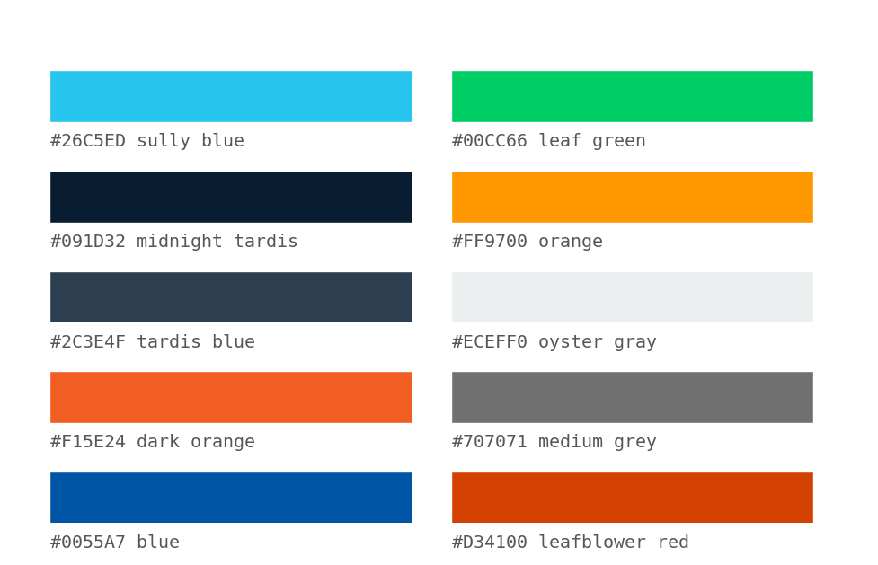

# mplsvds: matplotlib styling for svds

The general idea here is to build off of seaborn styling conveniences and mix in svds themes.

## References

http://matplotlib.org/faq/usage_faq.html

https://stanford.edu/~mwaskom/software/seaborn/tutorial/aesthetics.html

http://earthobservatory.nasa.gov/blogs/elegantfigures/2013/08/05/subtleties-of-color-part-1-of-6/

https://jiffyclub.github.io/palettable/

## Examples

[See this notebook!](demo.ipynb)

<!--  -->



## Documentaion

This is it for now!

## Dependencies

(todo: check everything works in both python 2 and 3)

- [numpy](http://www.numpy.org/)
- [scipy](http://www.scipy.org/)
- [matplotlib](http://matplotlib.org/)
- [pandas](http://pandas.pydata.org/)
- [seaborn](https://stanford.edu/~mwaskom/software/seaborn/)

## Intallation

Clone the parent repo and `cd` to the top level of this package:

```
python setup.py install
```

For developers, this is more convenient:

```
python setup.py develop
```

Run tests:

```
python -m unittest discover
```
